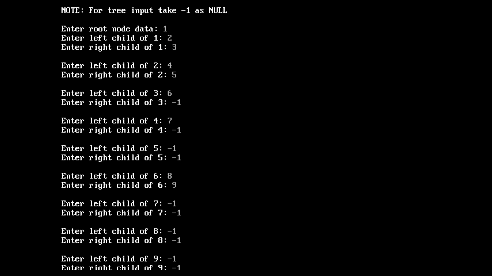
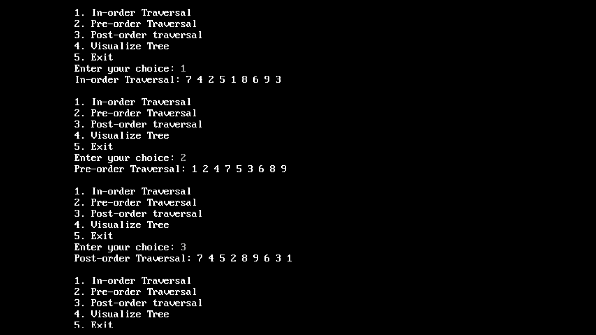
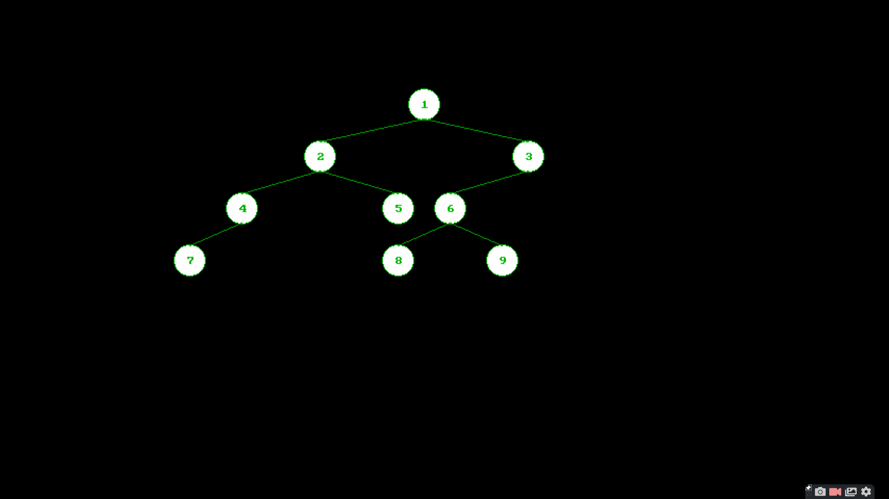

# Binary Tree Visualizer
A *Binary Tree Visualizer* implemented ***in C.***
- Combination of **Computer Graphics (CG)** and **Data Structures (DS)** mini projects. 

Code for Traversal - [tree_traversal.c](tree_traversal.c) (Part of a Data Structures Project)

Code for Visualizer - [tree_visualization.c](tree_visualization.c)(Part of a Computer Graphics Project)

## *Demonstration*
View the complete demonstration [in this LinkedIn Post](https://www.linkedin.com/posts/tusharnankani_binarytreevisualizer-c-visualization-ugcPost-6735769171239419904-YiiR) or [in this video](assets/complete-demo.mp4).

## *Features*
- Displays a customized tree. (Will be using the `graphics.h` *header file* in C.)
- Displays Pre-Order, In-Order & Post-Order traversals.

#### *Functions*
- `delay()` function.
- `putpixel()` function.
- `setcolor()` function.
- `cleardevice()` function: [Reference](https://www.geeksforgeeks.org/cleardevice-function-c/)
- `itoa()` function: [Reference](https://fresh2refresh.com/c-programming/c-type-casting/c-itoa-function/)
- `outtextxy()` function: [Reference](https://www.geeksforgeeks.org/outtextxy-function-c/) 
- `circle()`  function: [Reference](https://www.geeksforgeeks.org/draw-circle-c-graphics/)
- `floodfill()` function: [Reference](https://www.geeksforgeeks.org/setfillstyle-floodfill-c/)
  
#### Traversals
- In-Order Traversal (LNR: Left-Node-Right)
- Pre-Order Traversal (NLR: Node-Left-Right)
- Post-Order Traversal (LRN: Left-Right-Node)

## Setup
View the complete demonstration [in this video](assets/complete-demo.mp4).
- Download [Turbo C++](https://turboc.me/download-turbo-c-file/), since we will be using the `graphics.h` header file, which is only supported in TURBO.
- Clone the repository: `git clone https://github.com/tusharnankani/binary-tree-visualizer.git`
- Copy the [tree_visualization.c](tree_visualization.c) file.
- Go to `TURBOC3 > BIN`, and paste the copied file.
- Start `TURBO C++`, and open the respective file.
- Compile the file using the command: `Alt + F9`
- Run the file using the command: `Ctrl + F9`

### *Input*
- Enter the root node and simultaneously start entering *left and right child for the nodes*.
- NOTE: For tree input take -1 as NULL.

- Displays Pre-Order, In-Order & Post-Order traversals.

- Displays tree.

### Authors
- Kavya Nair
- Parth Namdev
- Tushar Nankani
